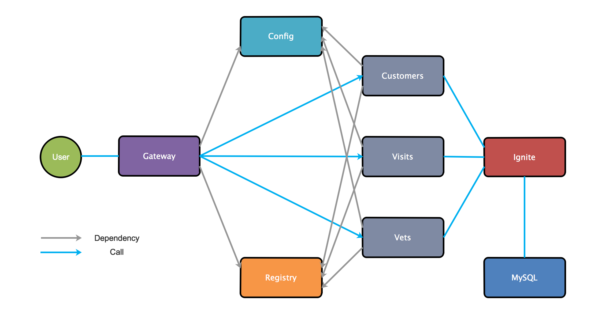

# [云框架]Ignite v0.1


[](CONTRIBUTORS.md)


在大数据时代，特别是在构建高性能、高可用的大型互联网系统时，缓存扮演着至关重要的角色。分布式缓存技术除了我们熟悉的Redis、Memcached，还有Oracle Coherence、Hazelcast，以及本篇云框架主题——[Apache Ignite](https://ignite.apache.org/)，一款“以内存为中心”的内存计算和事务平台。

**Apache Ignite vs.** [Redis](https://db-engines.com/en/system/Ignite%3BRedis) / [Memcached](https://db-engines.com/en/system/Ignite%3BMemcached) / [Oracle Coherence](https://db-engines.com/en/system/Ignite%3BOracle+Coherence) / [Hazelcast](https://db-engines.com/en/system/Hazelcast%3BIgnite)

Ignite具有持久性、一致性、高可用等主要特点，同时具备强大的SQL、键值以及相关API，非常适合大规模的数据集处理，解决了大规模、大量数据、高并发应用所面临的诸多痛点，如：

* 数据缓存
* 数据库负载
* 查询性能

本篇云框架结合实战经验，在[Spring Petclinic](https://github.com/spring-projects/spring-petclinic)（宠物医院，微服务架构应用）基础上进行“Ignite化”改造，并围绕此业务实例介绍Apache Ignite及其落地的最佳实践。

相关云框架：[[云框架]SMACK大数据架构](https://github.com/cloudframeworks-smack/user-guide-smack)

# 内容概览

* [性能对比](#性能对比)
* [快速部署](#快速部署)
    * [一键部署](#一键部署)
    * [本地部署](#本地部署)
* [业务说明](#业务说明)
* [技术说明](#技术说明)
* [如何变成自己的项目](#如何变成自己的项目)
* [更新计划](#更新计划)
* [社群贡献](#社群贡献)

# <a name="性能对比"></a>性能测试

**测试环境**

```
Macbook pro (Retina, 150inch, Mid 2015)
macOS Sierra 版本 10.12.6
处理器：2.5 GHz Intel Core i7
内存：16GB 1600 MHz DDR3
```

**测试结果**

<div align=center></div>

通过本机测试，我们对于Ignite的性能已经可以初见端倪。可以预见的是，在集群下面对大规模数据时，Ignite对于性能的提升将会非常明显。

# <a name="快速部署"></a>快速部署

## <a name="一键部署"></a>一键部署

[一键部署至好雨云帮](xx)

## <a name="本地部署"></a>本地部署

1. [准备Docker环境](./READMORE/install-docker.md)

2. 克隆完整代码

   ```
   git clone xx
   ```

3. 安装mysql

# <a name="业务说明"></a>业务说明

Spring Petclinic可完成宠物主人（Owner）、宠物（Vet）、到访（Visit）的注册／添加、查询、编辑等。

查看截图：

[主页](https://github.com/cloudframeworks-ignite/user-guide-ignite/blob/master/image/petclinic-homepage.png) ／ [查询所有信息](https://github.com/cloudframeworks-ignite/user-guide-ignite/blob/master/image/all-owners.png) ／ [注册宠物主人](https://github.com/cloudframeworks-ignite/user-guide-ignite/blob/master/image/add-owners.png) ／ [添加宠物](https://github.com/cloudframeworks-ignite/user-guide-ignite/blob/master/image/add-pets.png) ／ [编辑](https://github.com/cloudframeworks-ignite/user-guide-ignite/blob/master/image/pets-visits.png) ／ [查看Veterinarians](https://github.com/cloudframeworks-ignite/user-guide-ignite/blob/master/image/veterinarians.png)

业务架构如下：

<div align=center></div>

* User可对Owners进行操作，包括注册、查看信息、编辑
* 可为Owners添加Pets或修改Pets信息
* 可为Pets增加Visits
* User可查看所有Veterinarians

# <a name="技术说明"></a>技术说明


<div align=center></div>


# <a name="如何变成自己的项目"></a>如何变成自己的项目 


# <a name="更新计划"></a>更新计划

* `README` 集群测试

点击查看[历史更新](CHANGELOG.md)

# <a name="社群贡献"></a>社群贡献

+ QQ群: 
+ [参与贡献](CONTRIBUTING.md)
+ [联系我们](mailto:info@goodrain.com)

-------

[云框架](ABOUT.md)系列主题，遵循[APACHE LICENSE 2.0](LICENSE.md)协议发布。


